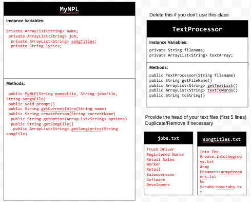
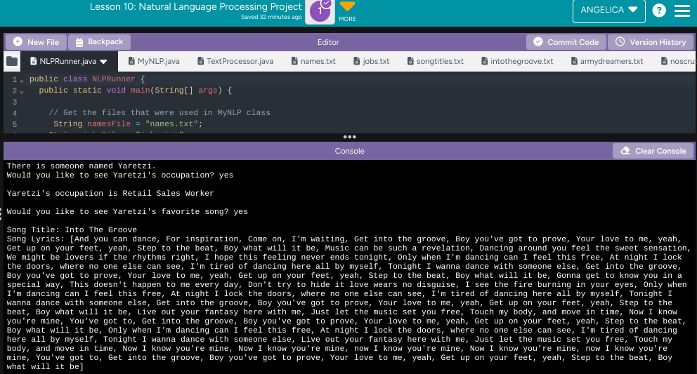

# Unit 6 - Natural Language Processing Project

## Introduction

Natural language processing (NLP) is used in many apps and devices to interact with users and make meaning of text to determine how to respond, find information, or to create new text. Your goal is to use natural language processing techniques to identify structure, patterns, and meaning in a text to have conversations with a user, execute commands, perform manipulations on the text, or generate new text.

## Requirements

Use your knowledge of object-oriented programming, ArrayLists, the String class, and algorithms to create a program that uses natural language processing techniques:

- **Create at least two ArrayLists** – Create at least two ArrayLists to store the data used in your program, such as data from text files or entered by the user.
- **Implement one or more algorithms** – Implement one or more algorithms that use loops and conditionals to find or manipulate elements in an ArrayList or String object.
- **Use methods in the String classs** - Use one or more methods in the String class in your program, such as to divide text into sentences or phrases.
- **Use at least one natural language processing technique** – Use a natural language processing technique to process, analyze, and/or generate text.
- **Document your code** – Use comments to explain the purpose of the methods and code segments and note any preconditions and postconditions.

## UML Diagram

Put and image of your UML Diagram here. Upload the image of your UML Diagram to your repository, then use the Markdown syntax to insert your image here. Make sure your image file name is one word, otherwise it might not properly get display on this README.

## Video

Record a short video of your project to display here on your README. You can do this by:

- Screen record your project running on Code.org.
- Upload that recording to YouTube.
- Take a thumbnail for your image.
- Upload the thumbnail image to your repo.
- Use the following markdown code:

## Project Description

The goal of my application was to get random names with random jobs and random songs. The reason I did this was because I was inspired by the friend generator as it was very entertaining to me, so I hope this one is just as entertaining. The text that is being analyzed is in my songtitles text file, which has the song title and the name of the text file to get to the lyrics. I split each row by the ":" and had it output the title, find which text file had the correct lyrics, and had it output the lyrics. The user interacts with my project by saying yes or no to whether they want to know about a "person" or not.

## NLP Techniques

In this project, the Natural Language Processing (NLP) technique used is Named Entity Recognition (NER), which focuses on identifying and processing entities like names, occupations, and song titles. The getOption() method selects random entities (names, jobs, and song titles) from predefined lists, simulating NER by identifying these entities. The createPerson() method links a name with an occupation, showing a relationship between two entities. Additionally, the getSongFile() method treats song titles as entities, associating them with their respective files. While the project doesn't analyze raw text, it effectively uses predefined lists to recognize and work with named entities like people and jobs.
